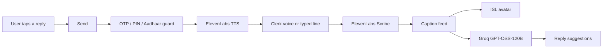

# Sampark

**A phone relay for deaf and non-verbal India.**

Sampark is the ears and mouth of a deaf or non-verbal person on one official call — electricity board, bank, hospital, cyber helpline 1930, emergency 112 / 108 / 101. The clerk on the other side uses a normal phone and installs nothing.

The clerk’s voice becomes **live captions** and an **Indian Sign Language** avatar. The user replies by tapping a suggestion and pressing **Send**, or by unmuting and speaking. The call ends on an **outcome card**: a complaint number, a pinned answer, or help dispatched — not a transcript dump.

Built for the IBM SkillBuild Hackathon. Product contract: [`AGENTS.md`](AGENTS.md). How IBM Bob was used: [`IBM_BOB.md`](IBM_BOB.md).

---

## Why it exists

Official India still runs on phone queues. A deaf or non-verbal person cannot hear hold music, cannot lip-read a clerk, and cannot safely speak an OTP into a relay. Existing “AI call” products auto-talk. Sampark does not.

Four rules. Breaking any of them means the feature is wrong:

1. **Nothing is spoken without Send** — except a signed-off emergency exception (112 / 108 / 101).
2. **OTP, PIN, CVV, password, and Aadhaar are never spoken** through TTS. They are redacted as `••••` in the saved transcript.
3. **The outcome card is the product.** Transcript sits behind “View full conversation.”
4. **All audio goes through `AudioTransport`.** Screens never touch the mic, speaker, or a phone API.

---

## Demo in one minute

```
Type or speak a clerk line
        → caption appears
        → ISL avatar signs it
        → 3–5 reply suggestions + 4 always-on ones
        → tap one → see the exact sentence → Send
        → voice speaks to the clerk
        → clerk says “complaint number COMP-4821”
        → pin banner → confirm → end call
        → outcome card shows COMP-4821 on top
```

Two-browser demo (no real phone required):

| Role | URL | What to do |
|---|---|---|
| User | `/setup` → `/start` → `/call` | Pick a playbook, watch captions, tap Send |
| Clerk | `/clerk` | Type or speak as the official. Same room id. |

SOS on `/start` is one tap into 112 / 108 / 101.

---

## Screens

| Route | Purpose |
|---|---|
| `/` | Landing |
| `/setup` | Once: name, home location, UI language (8), call language (Hindi or English), voice |
| `/start` | SOS, six category tiles, situation cards, ISL on/off, playbook facts, Call |
| `/call` | Captions, ISL avatar, reply suggestions, Send, Unmute, DTMF, silence ring, pin banners |
| `/clerk` | Operator console for the two-browser demo |
| `/outcome` | One card: reference **or** pinned answer **or** help dispatched |

Setup never asks for playbook facts. Facts live on the call until the user opts to save them on the outcome screen.

---

## Playbooks

Six categories. Hindi and English on the call. UI in eight languages: English, Hindi, Tamil, Telugu, Kannada, Malayalam, Marathi, Bengali.

| Category | Situations |
|---|---|
| Emergency | 112, Ambulance 108, Fire 101 |
| Utility | Power cut, water, gas / LPG |
| Money | Bank / Cyber 1930, block card |
| Health | Hospital, lab report, bed availability |
| Government | Ration shop, Aadhaar, pension, certificate |
| Legal | File an FIR, FIR follow-up, legal aid |

---

## How the loop works



- Captions: ElevenLabs Scribe v2 Realtime (`scribe_v2_realtime`). If Scribe fails, the UI shows **captions off** and the typed clerk-line path still works. There is no second STT vendor.
- Suggestions: Groq **`openai/gpt-oss-120b`** (GPT-OSS-120B). Temperature ~0.2, JSON only. Labels in the UI language; sentences in the call language. The client file is still named `lib/watsonx/llama.ts`; that name is historical. watsonx Llama is an optional `LLM_PROVIDER=watsonx` path, not the default.
- Speech out: ElevenLabs `eleven_flash_v2_5` through `POST /api/tts`, cancellable for barge-in. Browser `speechSynthesis` only if ElevenLabs fails (**Demo voice** banner).
- ISL: CWASA SiGML player + sign files vendored from [shoebham/text_to_isl](https://github.com/shoebham/text_to_isl). Unknown words fingerspell.
- Always-on suggestions, every call: Wait / Please repeat / I did not understand / Please give the complaint number.
- Unmute is one entity: speaking cancels TTS instantly; the utterance is captioned as **You** and the model does not repeat it.
- Phase 2 phone: `ExotelTransport` is stubbed. Demo audio is `RoomTransport` (mic/speaker).

Privacy: facts, transcripts, and outcomes stay in **localStorage / IndexedDB**. No accounts. No server database. Past call transcripts are never sent to the LLM.

---

## Stack

| Job | Service |
|---|---|
| App | Next.js 15 (App Router), TypeScript, Tailwind, PWA |
| Captions | ElevenLabs Scribe v2 Realtime |
| Speech out | ElevenLabs TTS (server proxy) |
| Reply LLM | Groq `openai/gpt-oss-120b` (GPT-OSS-120B) |
| ISL | CWASA + vendored SiGML files |
| i18n | `next-intl` — 8 UI languages |
| Hosting | Railway — custom Node server for clerk-room WebSocket |

---

## Local setup

Node 20+.

```bash
git clone https://github.com/snk189/ibm_hack.git
cd ibm_hack
cp .env.local.example .env.local   # fill keys
npm install
npm run dev
```

Open [http://localhost:3000](http://localhost:3000). The clickable loop works without API keys (typed clerk line + browser voice). Captions, cloud TTS, and LLM suggestions need keys.

```bash
npm run dev:ws    # optional WebSocket room relay (HTTP long-poll works without it)
npm test
npm run build && npm start
```

### Environment

Copy [`.env.local.example`](.env.local.example). Never commit `.env.local`.

| Variable | Required | Purpose |
|---|---|---|
| `ELEVENLABS_API_KEY` | For live captions + cloud TTS | Scribe token + TTS proxy |
| `ELEVENLABS_VOICE_ID_HI` / `_EN` / `_VOICE_ID` | Optional | Fallbacks if a catalog voice id is missing |
| `LLM_PROVIDER` | Default `groq` | `groq` or `watsonx` |
| `GROQ_API_KEY` | If Groq | Reply suggestions, gloss |
| `GROQ_MODEL` | Optional | Default `openai/gpt-oss-120b` |
| `WATSONX_API_KEY` | If watsonx | IBM watsonx.ai |
| `WATSONX_PROJECT_ID` | If watsonx | Project id |
| `WATSONX_URL` | Optional | Default `https://us-south.ml.cloud.ibm.com` |
| `WATSONX_MODEL` | Optional | Default `meta-llama/llama-3-3-70b-instruct` |
| `PORT` | Set by the host | Railway injects this |

Voice ids the user can pick live in `lib/voices.ts`.

---

## Hosting (Railway)

This app is **not** a pure Vercel static/serverless site. The two-browser demo needs a long-lived Node process (`server.js`) so `/api/room-relay` can upgrade to WebSocket. HTTP long-poll is the fallback if WebSocket is down.

`railway.toml` already sets Nixpacks, `npm run build`, and `npm start`.

1. Create a Railway project from `https://github.com/snk189/ibm_hack`.
2. Add the variables from the table above (no `.env.local` file on the host).
3. Deploy. Railway sets `PORT`; `server.js` binds `0.0.0.0`.
4. Generate a public domain. Open `/` then run the two-browser demo on `/call` and `/clerk`.

```bash
npm run build
npm start
```

`npm start` runs `server.js` in production (WebSocket + Next). Do not use `next start` on the host — that drops the room WebSocket.

---

## API

| Endpoint | Body | Returns |
|---|---|---|
| `POST /api/scribe-token` | — | `{ token }` short-lived Scribe token. API key never reaches the browser. |
| `POST /api/tts` | `{ text, lang }` | Streamed audio. Must cancel immediately on barge-in. |
| `POST /api/suggest` | `{ caption, history, facts, goal, callLanguage }` | `{ suggestions: [{ id, label, sentence }] }` — 3–5 items, JSON only. |
| `POST /api/gloss` | `{ text }` | `{ gloss: ["MORNING", "POWER", "CUT"] }` |
| `/api/room-relay` | WebSocket (custom server) or HTTP GET/POST | Clerk ↔ user room sync |
| `/api/jas/*` | — | Same-origin proxy for CWASA avatar assets (CORS) |

Guards live in `lib/guard/`: TTS block on OTP/PIN/CVV/password/Aadhaar, reference-number detector, transcript redaction.

---

## Repo map

```
app/            routes and API
components/     CaptionFeed, ReplySuggestions, ISLAvatar, OutcomeCard, …
lib/
  transport/    AudioTransport, RoomTransport, ExotelTransport (stub)
  elevenlabs/   Scribe (browser, token) + TTS client
  watsonx/      LLM client (GPT-OSS-120B default): suggest / gloss
  guard/        OTP block, reference numbers, redaction
  store/        localStorage / IndexedDB
playbooks/      situation JSON
messages/       8 UI language files
public/isl/     CWASA player + SiGML sign files
docs/bob-log/   Bob session log (README only; no PNGs in repo)
IBM_BOB.md      how IBM Bob was used (SkillBuild required)
AGENTS.md       product contract
```

---

## IBM Bob

IBM Bob authored the first commit: [`AGENTS.md`](AGENTS.md) and the Next.js scaffold (then named Setu). The live app still uses that contract. Reply suggestions and gloss still go through the module Bob stubbed (`lib/watsonx/llama.ts`); the **model we run is Groq GPT-OSS-120B**, not Llama.

Full record, matched to git: [`IBM_BOB.md`](IBM_BOB.md).

---

## Credits

- ISL avatar: **CWASA SiGML player** and Indian Sign Language sign files vendored from [github.com/shoebham/text_to_isl](https://github.com/shoebham/text_to_isl).
- Team: Tanish M (live call loop), Arya (screens + playbooks), Satyeta (APIs, guards, captions).

Contract and judging docs: [`AGENTS.md`](AGENTS.md) · [`IBM_BOB.md`](IBM_BOB.md).
